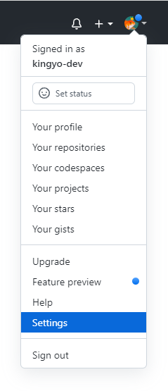
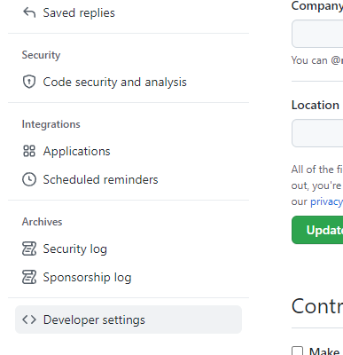
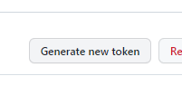
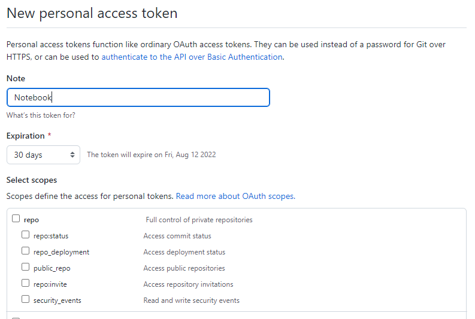

# Персональные токены доступа в GitHub

Как я понял, `токены` пришли на замену пароля для защиты аккаунта от несанкционированного доступа. Смысл в том, что при работе с вашими репозиториями больше не нужно использовать пароль от аккаунта. Вместо пароля  используем `токен` для которого можно разрешить или запретить разные действия (например: удалять репозитории).

Разумно, здорово. За исключением того, что при первом коммите от GitHub приходит много букв о том, что токен теперь используется вместо пароля, но букв настолько много, что не понятно где и как этот токен добыть. В общем, вот небольшой гайд.

## Создание токена

Что бы получить `персональный токен` заходим в настройки аккаунта `Settings`.

Слева в меню выбираем `Developer settings`.

В меню выбираем `Personal access token`.

Создаем новый токен `Generate new token`.

Указываем заметки `Note`, время жизни `Expiration` и разрешения для токена `Scopes`. 

Полученный токен используем вместо пароля при работе с репозиториями.