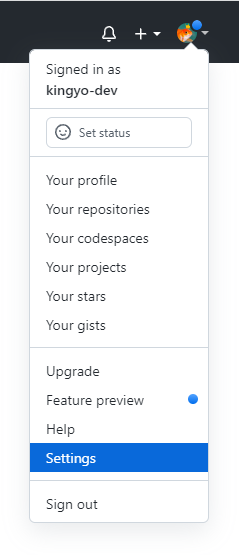
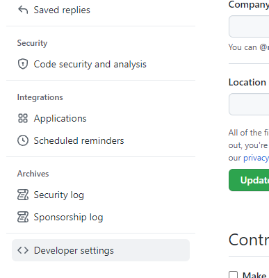
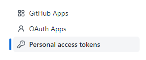
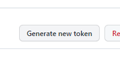
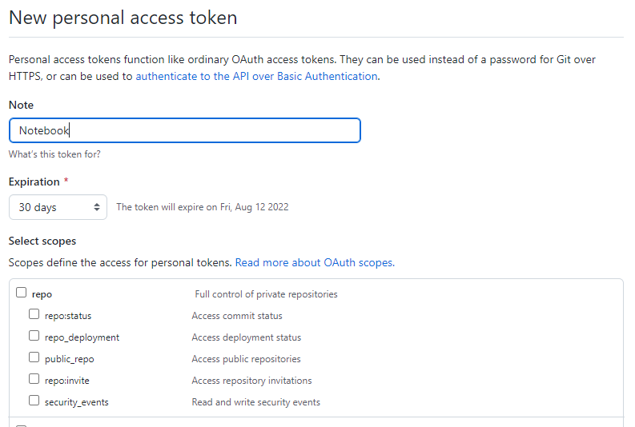

# Персональные токены доступа в GitHub

Как я понял, `токены` пришли на замену пароля для защиты аккаунта от несанкционированного доступа. Смысл в том, что при работе с вашими репозиториями больше не нужно использовать пароль от аккаунта. В место пароля  используем токен.

Разумно, здорово.

## Создание токена

Что бы получить персональный токен заходим в настройки аккаунта `Settings`.

Слева в меню выбираем `Developer settings`.

В меню выбираем `Personal access token`.

Создаем новый токен `Generate new token`.

Указываем заметки `Note`, время жизни `Expiration` и разрешения для токена `Scopes`. 

Полученный токен используем вместо пароля при работе с репозиториями.