# Работа с таблицами Google через Google Sheet API. Часть первая: аутентификация.

- [Регистрация и настройка приложения в Google Cloud](#регистрация-и-настройка-приложения-в-google-cloud)
  - [Создаем новый проект](#создаем-новый-проект)
  - [Согласия и тестеры.](#согласия-и-тестеры)
  - [Создаем файл с ключом credentials.json](#создаем-файл-с-ключом-credentialsjson)
  - [Подключаем поддержку Google Sheets API](#подключаем-поддержку-google-sheets-api)
- [Приложение](#приложение)
  - [Подключаем библиотеку Google API](#подключаем-библиотеку-google-api)
  - [Пример создания таблицы](#пример-создания-таблицы)
  - [Упрощаем авторизацию](#упрощаем-авторизацию)

Официальная документация по Google Sheets API: [https://developers.google.com/sheets/api/guides/concepts](https://developers.google.com/sheets/api/guides/concepts)

# Регистрация и настройка приложения в Google Cloud

Для того, что бы приложение смогло работать с API и сервисами Google, его нужно зарегистрировать в [Google Cloud](https://console.cloud.google.com/).

Порядок действий при регистрации таков:

- Создать новый проект.
- Настроить согласия.
- Указать тестеров.
- Выбрать метод аутентификации приложение (`OAuth`).
- Получить реквизиты (`credentials`) для работы приложения с Google API.
- Указать API которые будет использовать приложение.

В процессе регистрации получаем файл `credentials.json` содержащий ключи для подключения приложения и секретики для `OAuth` авторизации пользователя. Этот файл не имеет доступа к данным аккаунта, таким как таблицы или диск. По сути это разрешение от Google для приложения на работу с Google API.

Дальше, говорим Google привет, передавая данные из `credentials.json`. В случае успеха Google признает приложение и позволяет сгенерировать ссылку для пользователя, по которой он сможет авторизовать приложение. Если пользователь согласен, то он получает код, который вводится в приложение и генерируется секретный токен, используя который приложение сможет делать запросы к Google API и оперировать данными пользователя, например работать с таблицами Google.

## Создаем новый проект

Заходим в [Google Cloud console https://console.cloud.google.com/](https://console.cloud.google.com/)

Рядом с кнопкой меню `Google Cloud` нажимаем кнопку выбора проекта.

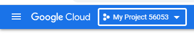

В появившемся окне выбора проекта `Select Project` нажимаем кнопку `NEW PROJECT`

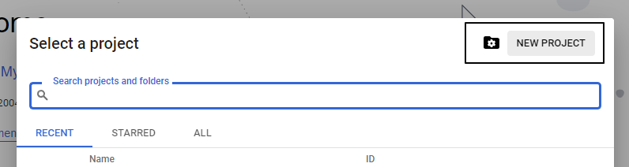

Указываем имя проекта `Project name` и жмем кнопку `CREATE`.

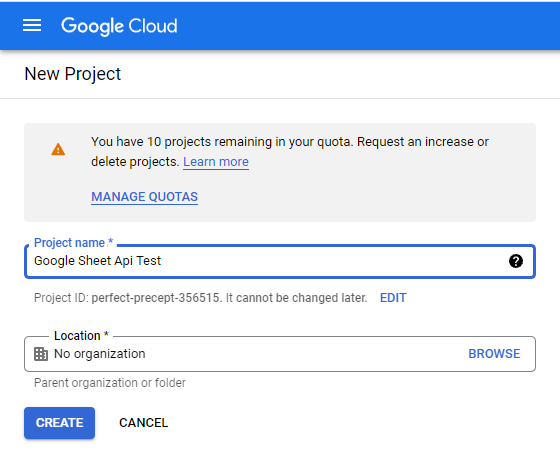

Выбираем созданный проект рядом с кнопкой меню `Google Cloud`

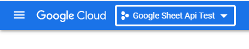

## Согласия и тестеры

В меню Google Cloud выбираем `APIs & Services` \ `OAuth consent screen`.

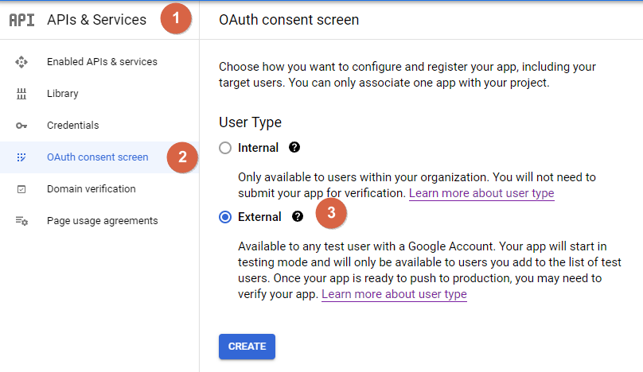

Выбираем режим согласия.

- `Internal` - Приложение доступно только пользователям компании. Не нужно выполнять проверку приложения (verification). Режим не доступен для обычных Google аккаунтов.

- `External` - Доступно только тестерам. Для общего доступа требуется проверка (verification), после чего приложением сможет использовать любой пользователь Google.

Выбираем `External`.

Заполняем форму `OAuth consent screen`. Указываем важные поля отмеченные звездочкой, остальное можно пропустить.

Жмем `SAVE AND CONTINUE`.

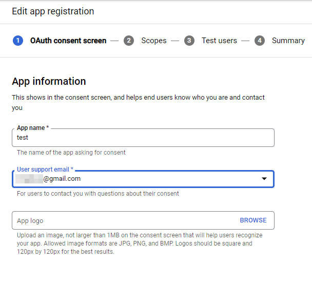

В разделе `Scopes` оставляем все как есть, сразу жмем кнопку `SAVE AND CONTINUE`.

В разделе `Test users` жмем `ADD USER`.

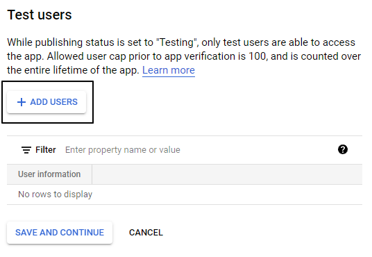

В появившемся окне указываем `email` пользователя которому будет доступно приложение. 

Как минимум укажите ваш `email`. Система не считает вас тестером, хоть вы и владелец проекта.

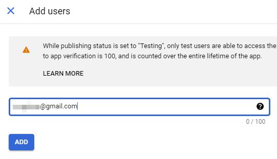

Все сделанные настройки всегда можно изменить в разделе `APIs & Services` \ `OAuth consent screen`

## Создаем файл с ключом `credentials.json`

В меню `Google Cloud` выбираем `APIs & Services` / `Credentials`.

Жмем кнопку `CREATE CREDENTIALS`.

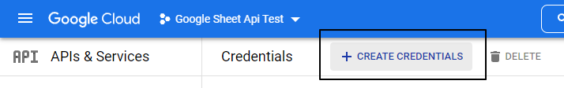

Выбираем `OAuth client ID`.

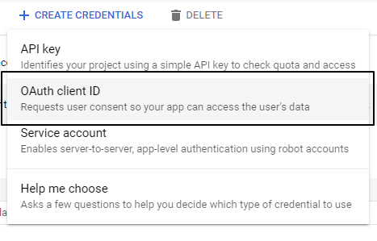

Устанавливаем `Application type` в `Desktop app`. Жмем кнопку `CREATE`

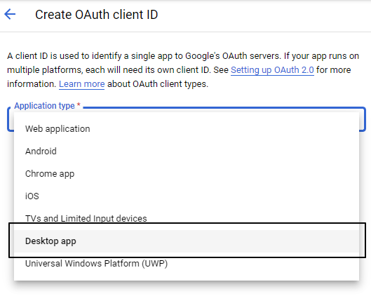

В появившемся окне жмем кнопку `DOWNLOAD JSON`.

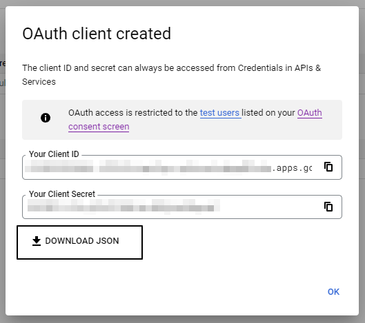

Сохраняем в папку приложения как `credentials.json`

> Файл ключа можно получить в разделе `APIs & Services` / `Credentials` в списке ключей `OAuth 2.0 Client IDs` нажав иконку в виде стрелочки вниз (скачать). 
>
> 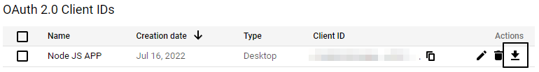

## Подключаем поддержку Google Sheets API

Заходим в `APIs & Services` \ `Enable APIs & Services`.

Нажимаем кнопку `ENABLE API AND SERVICES`.

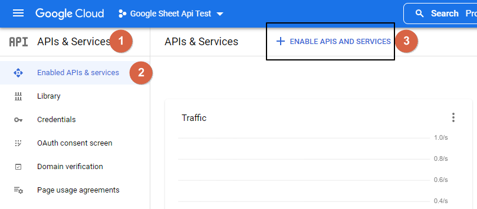

Находим и нажимаем `Google Sheets API`.

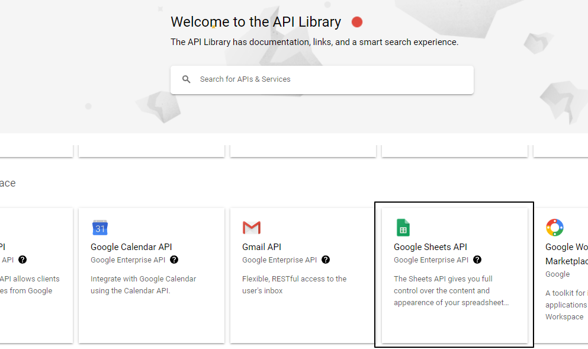

В появившемся окне нажимаем кнопку `ENABLE`

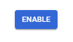

# Приложение

## Подключаем библиотеку Google API

```
npm install googleapis --save
```

## Пример создания таблицы

Данный пример создаст пустую таблицу с названием `test`.

```javascript
import fs from 'fs'
import readline from 'readline'
import {google} from 'googleapis'

// Права доступа к данным пользователя для приложения.

const SCOPES = [
    'https://www.googleapis.com/auth/spreadsheets', // Запись/чтение таблиц.
]

// Путь сохранения файла токена.

const TOKEN_PATH = 'token.json'

/*
    Авторизация.

    @resolve oAuth2Client
*/

async function authorize() {

    return new Promise((resolve, reject) => {

        // Читаем файл credential.json содержащий реквизиты для входа.

        fs.readFile('credentials.json', (error, content) => {
        
            if (error) {
                return reject(error)
            }

            const {client_secret, client_id, redirect_uris} = JSON.parse(content).installed
            
            const oAuth2Client = new google.auth.OAuth2(client_id, client_secret, redirect_uris[0])

            // Авторизуемся используя сохраненный токен.
            // Если файл не найден запрашиваем новый токен.

            fs.readFile(TOKEN_PATH, (error, content) => {

                if (error) {
                    
                    // Запрашиваем новый токен.

                    // Формируем URL для авторизации.
                    // По этому URL можно подтвердить доступ к таблицам 
                    // и получить код для создания токена.

                    const authUrl = oAuth2Client.generateAuthUrl({
                        access_type: `offline`,
                        scope: SCOPES,
                    })

                    console.log('Authorize this app by visiting this url:', authUrl)

                    // Ожидаем ввода токена.

                    const rl = readline.createInterface({
                        input: process.stdin,
                        output: process.stdout,
                    })

                    rl.question('Enter the code from that page here: ', (code) => {
                        
                        rl.close()
                        
                        oAuth2Client.getToken(code, (error, token) => {
                            
                            if (error) {
                                return reject (error)
                            }
                            
                            oAuth2Client.setCredentials(token)

                            // Записываем токен в файл.

                            fs.writeFile(TOKEN_PATH, JSON.stringify(token), (error) => {
                                
                                if (error) {
                                    return reject(error)
                                }

                                console.log(`Token stored to ${TOKEN_PATH}`)

                                resolve(oAuth2Client)

                            })

                        })

                    })

                    return

                }

                // Авторизуемся при помощи полученного токена.

                oAuth2Client.setCredentials(JSON.parse(content))

                resolve(oAuth2Client)

            })

        })

    })

}

/*
    Создать новую таблицу.

    @param auth - oAuth2Client.
    @param title - название таблицы.

    @return - id созданной таблицы.
*/

async function createSpreadsheet(auth, title) {

    const service = google.sheets({version: 'v4', auth})

    const resource = {
        properties: {
            title,
        },
    }

    try {

        const spreadsheet = await service.spreadsheets.create({
            resource,
            fields: 'spreadsheetId',
        })
        
        return spreadsheet.data.spreadsheetId

    } 
    catch(error) {
        throw error
    }

}

try {
    let auth = await authorize()
    let spreadsheetId = await createSpreadsheet(auth, "test")
    console.log(`Spreadsheet ID: ${spreadsheetId}`)
}
catch (error) {
    console.error(error.message)
}
```

Порядок работы таков.

Если приложение не найдет файла `token.json` она выведет ссылку по которой можно авторизовать приложение. 

```
PS Z:\Home\Projects\experiments\google_sheets> node .
Authorize this app by visiting this url: https://accounts.google.com/o/oauth2/v2/auth?access_type=offline&scope=https%3A%2F%2Fwww.googleapis.com%2Fauth%2Fspreadsheets&response_type=code&client_id=610559810446-i707c3iiqutlgvrqlntachcpbgd8luds.apps.googleusercontent.com&redirect_uri=http%3A%2F%2Flocalhost
Enter the code from that page here: 
```

Перейдя по ссылке выбираем аккаунт. 

> Помним: адрес электронный почты пользователя должен быть добавлен в список тестеров проекта приложения.

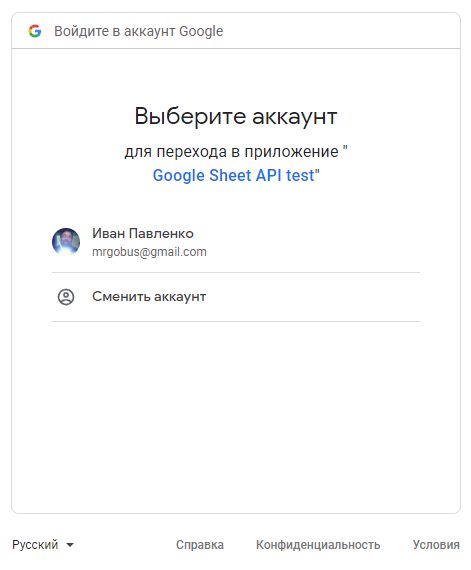

Нас предупреждают, что приложение не прошло проверку. 

Жмем `Продолжить`.

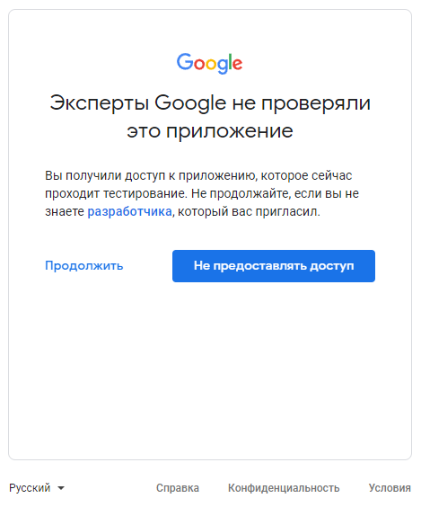

Соглашаемся с тем, что приложение будет иметь доступ к таблицам Google. 

Жмем `Продолжить`.

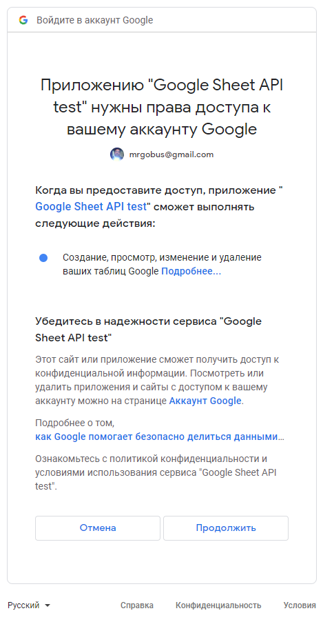

В результате Google перенаправляет нас по ссылке:

```
http://localhost/?code=3x0AdQt8qh0ihdZ5grKAEwHYrNmQQSP5EudQY2NRk0sPCY4bIEWwBDKGb7UoSXhN9wbnv-SyA&scope=https://www.googleapis.com/auth/spreadsheets
```
Копируем значение `сode` (после `code=` до `&scope`)

```
3x0AdQt8qh0ihdZ5grKAEwHYrNmQQSP5EudQY2NRk0sPCY4bIEWwBDKGb7UoSXhN9wbnv-SyA
```

И вводим в запрос приложения:

```
PS Z:\Home\Projects\experiments\google_sheets> node .
Authorize this app by visiting this url: https://accounts.google.com/o/oauth2/v2/auth?access_type=offline&scope=https%3A%2F%2Fwww.googleapis.com%2Fauth%2Fspreadsheets&response_type=code&client_id=610559810446-i707c3iiqutlgvrqlntachcpbgd8luds.apps.googleusercontent.com&redirect_uri=http%3A%2F%2Flocalhost
Enter the code from that page here: 3x0AdQt8qh0ihdZ5grKAEwHYrNmQQSP5EudQY2NRk0sPCY4bIEWwBDKGb7UoSXhN9wbnv-SyA
(node:1468) ExperimentalWarning: The Fetch API is an experimental feature. This feature could change at any time
(Use `node --trace-warnings ...` to show where the warning was created)
Token stored to token.json
Spreadsheet ID: 1eQ-xh3GlsZVmop2CR5Vx7mhxtHRE_Qa5yj8f1bYzd6w
```

> Повторный запуск программы не потребует авторизации, так как токен пользователя сохранен, и будет браться из файла `token.json`

Заходим в таблицы Google и видим созданную таблицу с названием `test`.

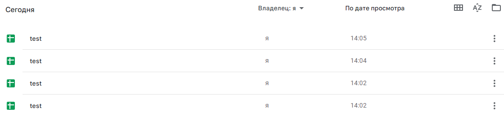

> Новая талица с названием `test` будет создаваться при каждом запуске программы =) 

## Упрощаем авторизацию

Все написанное выше было создано на базе документации Google, его недоговорках и моем знании английского. Теперь, когда у меня появился хоть какой то успешный опыт, начинаются приключения.

Мне не понравилось копировать длинный и корявый код подтверждения из ссылки и вставлять его ручками. Пффф... такое клиенту не продать =\ Так что, автоматизируем эту часть.

Как можно было заметить, после подтверждения приложения Google перенаправляет нас на `http://localhost`. И тут, у меня возник вопрос, а что мешает не ждать ввода токена через `readline` а просто создать сервер, поймать запрос и получить из него нужный нам код. Уж что что, а это node.js умеет.

Вешать сервер на `http://localhost` не корректно, так как это порт `80` и на нем часто что то висит. Что бы не конфликтовать явно укажем порт в адресе, например `8666` (`http://localhost:8666`). 

Просто заменить `redirect_uris` не получится, Google строг и не позволяет зарегистрировать пользователя для работы с приложением. А значит нужно создать новый `credentials`.

Заходим в [https://console.cloud.google.com/](https://console.cloud.google.com/).

Выбираем `APIs & Services` \ `Credentials`.

Жмем `CREATE CREDENTIALS` и выбираем `OAuth client ID`.

Так случилось, что для `Desctop app` нельзя указать `Authorized redirect URIs`. 

Выбираем `Web application`, заполняем и добавляем нужный нам `URI`.

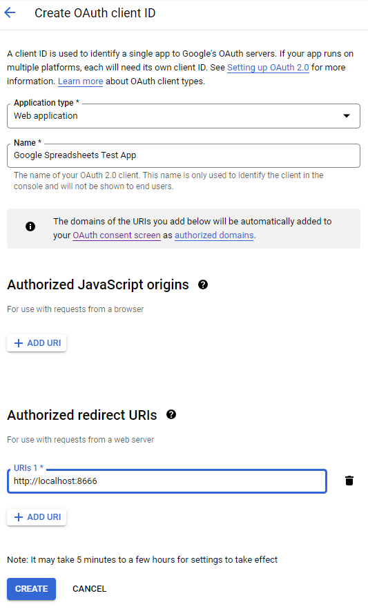

В появившемся окне жмем `DOWNLOAD JSON` и сохраняем в папку приложения под именем `credentials.json`.

Если в папке приложения есть файл `token.json` удаляем его.

В `credentials.json` для `Web application` секретики хранятся в разделe `web` а не `installed`. Находим строку где мы получаем значения для авторизации и вносим изменения меняя `installed` на `web`.

```javascript
const {client_secret, client_id, redirect_uris} = JSON.parse(content).web
```

Запускаем приложение, и вуаля, адрес ссылки содержит указанный нами порт `http://localhost:8666`.

```
http://localhost:8666/?code=2/0AdQt8qjMXUfNRvqHAThlzarNwvqjhxztd7amp9SJeQAo6Q5EvYFoq3MK6hSnfs1nlBGHhg&scope=https://www.googleapis.com/auth/spreadsheets
```
Успех. Пол дела сделано, думал я, но не тут то было. Я решил пойти простым путем, и ловить ответ авторизации при помощи `express.js`. Но, оказалось, `express.js` не умеет выходить. То есть, даже на сервере указано что можно вызвать `server.close()`, но на практике, такой функции у объекта нет O_o.

Углубляться в тему было не охота, так что пишем с использованием `node:net`. 

Код ожидания выносим в функцию `waitForAuthCode`, которая запускает сервер слушающий на указанному порту и ждет запроса содержащего подстроку `code=`. Все остальное она игнорирует. 

Когда функция получает долгожданный код, она останавливает сервер и возвращает код.

```javascript
import net from 'node:net'
```

```javascript
/*
    Ожидает получения кода авторизации Google.

    @return - код авторизации.
*/

const waitForAuthCode = async port => new Promise((resolve, reject) => {

    const SNIPPET_CODE = 'code='

    let server = net.createServer(socket => {
        socket.on('data', data => {
            let body = data.toString()
            let pos = body.indexOf(SNIPPET_CODE)
            if (pos === -1) {
                socket.close()
                return
            }
            pos += SNIPPET_CODE.length
            let end = pos
            while(1) {
                if ((body[end] === '&') || (body[end] === "\n") || !body[end]) {
                    break
                }
                end++
            }
            let code = body.slice(pos, end)
            socket.write(
                [
                    'HTTP/1.1 200 OK',
                    'Content-Type: text/html; charset=utf-8',
                    '',
                    '<!DOCTYPE html><html><head><meta charset="utf-8"></head><body>Спасибо за регистрацию. Эту страницу можно закрыть.</body></html>',
                ].join('\n'), 
                () => {
                    socket.end()
                    server.close()
                    resolve(code)
                }
            )
        })
    })

    server.listen(port)    

})
```

Вставляем все это в функцию авторизации вместо `readline`.

```javascript
/*
    Авторизация.

    @resolve oAuth2Client
*/

async function authorize() {

    return new Promise((resolve, reject) => {

        // Читаем файл credential.json содержащий реквизиты для входа.

        fs.readFile('credentials.json', (error, content) => {
        
            if (error) {
                return reject(error)
            }

            const {client_secret, client_id, redirect_uris} = JSON.parse(content).web
            
            const oAuth2Client = new google.auth.OAuth2(client_id, client_secret, redirect_uris[0])

            // Авторизуемся используя сохраненный токен.
            // Если файл не найден запрашиваем новый токен.

            fs.readFile(TOKEN_PATH, async (error, content) => {

                if (error) {
                    
                    // Запрашиваем новый токен.

                    // Формируем URL для авторизации.
                    // По этому URL можно подтвердить доступ к таблицам 
                    // и получить код для создания токена.

                    const authUrl = oAuth2Client.generateAuthUrl({
                        access_type: `offline`,
                        scope: SCOPES,
                    })

                    console.log('Authorize this app by visiting this url:', authUrl)

                    let code = await waitForAuthCode(AUTH_SERVER_PORT)

                    oAuth2Client.getToken(code, (error, token) => {

                        if (error) {
                            return reject (error)
                        }

                        oAuth2Client.setCredentials(token)

                        // Записываем токен в файл.

                        fs.writeFile(TOKEN_PATH, JSON.stringify(token), (error) => {

                            if (error) {
                                return reject(error)
                            }

                            console.log(`Token stored to ${TOKEN_PATH}`)
    
                            resolve(oAuth2Client)

                        })

                    })

                    return

                }

                // Авторизуемся при помощи полученного токена.

                oAuth2Client.setCredentials(JSON.parse(content))

                resolve(oAuth2Client)

            })

        })

    })

}
```

И, о да, ОНО РАБОТАЕТ!!!

```
PS Z:\Home\Projects\experiments\google_sheets> node .
Authorize this app by visiting this url: https://accounts.google.com/o/oauth2/v2/auth?access_type=offline&scope=https%3A%2F%2Fwww.googleapis.com%2Fauth%2Fspreadsheets&response_type=code&client_id=610559810446-mvc4dv7i31b4fmj46o09hb9tvbbp7grc.apps.googleusercontent.com&redirect_uri=http%3A%2F%2Flocalhost%3A8666
(node:9848) ExperimentalWarning: The Fetch API is an experimental feature. This feature could change at any time
(Use `node --trace-warnings ...` to show where the warning was created)
Token stored to token.json
Spreadsheet ID: 1VTcVIAYKVgGC-dZD9ebmCbnZsTl2l6ey-6neggoKj18
```