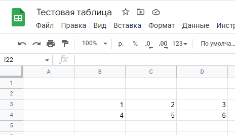

# Работа с таблицами Google через Google Sheet API. Часть вторая: чтение и запись данных.

- [Получение ID таблицы (spreadsheetId)](#получение-id-таблицы-spreadsheetid)
- [Создание новой таблицы](#создание-новой-таблицы)
- [Получаем информацию о таблице](#получаем-информацию-о-таблице)
- [Чтение и запись данных](#чтение-и-запись-данных)
  - [Запись данных в таблицу (Single Range)](#запись-данных-в-таблицу-single-range)
  - [Запись нескольких диапазонов (Multiple ranges)](#запись-нескольких-диапазонов-multiple-ranges)
  - [Добавление (Appending)](#добавление-appending)
  - [Чтение данных из таблицы (Single Range)](#чтение-данных-из-таблицы-single-range)
  - [Пакетное чтение](#пакетное-чтение)
- [Updating Spreadsheets (Пакетное обновление)](#updating-spreadsheets-пакетное-обновление)

В связи с тем, что для создания приложение которое работает с `Google API` нужно пройти семь кругов ада по регистрации и аутентификации, первая часть гайда оказалась посвящена регистрации приложения в Google и подключении пользователя. О работе с таблицами по сути не было ни слова, за исключением создания пустой таблицы, для того, что бы убедится в том, что у нас все работает. Так что, во второй части займемся непосредственно работой с таблицей.

В примерах, я вынес код из отдельной функции `createSpreadsheet` в корень файла. Сделано это по причине того, что у нас может быть несколько операций подряд, и заворачивать каждую в отдельную функцию с блоком `try catch` будет немного громоздко. Также, нам не придется каждый раз создавать `service`. Буду использовать экземпляр созданный один раз после авторизации.

В примерах, я буду упускать блок авторизации (код функции `authorize`) который был подробно описан в первой части а сфокусируюсь на коде по работе с таблицами.

# Получение ID таблицы (spreadsheetId)

Для того, что бы работать с таблицей, нам нужно знать ее ID. На данный момент я знаю два способа.

1. Получить ID при создании таблицы.

2. Получить ID из адреса таблицы открыв ее на сайте [https://docs.google.com/spreadsheets](https://docs.google.com/spreadsheets).
  
   Адрес таблицы:

   ```
   https://docs.google.com/spreadsheets/d/1-r7gI_DbJJEhDNCnohS15WHtGk6toqBGaucD4rEMh0Y/edit#gid=0
   ```

   ID таблицы (spreadsheetId):

   ```
   1-r7gI_DbJJEhDNCnohS15WHtGk6toqBGaucD4rEMh0Y
   ```

# Создание новой таблицы

```javascript
try {
    
    let auth = await authorize()
    const service = google.sheets({version: 'v4', auth})

    // Создаем новую таблицу

    const spreadsheet = await service.spreadsheets.create({
        resource: {
            properties: {
                title: "Тестовая таблица"
            },
            sheets: [
                {
                    properties: {
                        title: "Листок номер один"
                    }
                }
            ]
        },
        fields: 'spreadsheetId',
    })

    const spreadsheetId = spreadsheet.data.spreadsheetId

    console.log(`Create spreadsheet with ID: ${spreadsheetId}`)

}
catch (error) {
    console.error(error.message)
}
```

Функция `service.spreadsheets.create` получает набор параметров на основе которых делает запрос. Запрос содержит два поля: 
    
- `resource` - данные, на основе которых будет создана таблица. Описание всех параметров выходит за рамки статьи, если интересно читаем тут: [https://developers.google.com/sheets/api/reference/rest/v4/spreadsheets#Spreadsheet](https://developers.google.com/sheets/api/reference/rest/v4/spreadsheets#Spreadsheet).

- `fields` - ~~непонятное поле. Если его убрать, ничего не изменится, если изменить значение, будет ругаться.~~

  маска для указания какие поля обновляются. Можно указать `"*"` для обновления всех полей. Разделитель значений запятая.

При желании, можно создать таблицу со сложной структурой, формулами, диапазонами, цветами, форматированием и т.п. Но, я не приследую такие цели, да и думаю никогда не буду делать это из NodeJS. Думаю, что все что нужно, это создать таблицу и наполнить ее данными, например результатами парсинга интернет магазина. По этому, при создании таблицы указываю минимальное количество параметров.

- `properties.title` - имя таблицы.

- `sheets[].properties.title` - имя листа. 

> ## __Это важно__. 
>
> Google, при создании новой таблицы, по умолчанию называет листы в зависимости от языковых настроек пользователя. Для англичанина это будет `Sheet1`, а для русского `Лист1`. В дальнейшем, для чтения/записи данных в таблице, потребуется указать `range` в так называемой `A1` нотации, где указывается имя листа на который нужно вставить данные. Но, мы не можем с уверенность сказать, как этот лист называется. По этому, задаем имя листа четко, при создании таблицы.

Пример создания таблицы со сложной структурой, данными и форматом ячейки:

```javascript
    const spreadsheet = await service.spreadsheets.create({
        resource: {
            properties: {
                title: "Тестовая таблица"
            },
            sheets: [
                {
                    properties: {
                        title: "Листок номер один"
                    },
                    data: [
                        {
                            rowData: {
                                values: [
                                    {
                                        userEnteredValue: {
                                            stringValue: "Hello world"
                                        },
                                        userEnteredFormat: {
                                            backgroundColor : {
                                                red: 1,
                                                green: 1,
                                                blue: 0,
                                            }
                                        },
                                        note: "заметка для ячейки",
                                    },
                                    {
                                        userEnteredValue: {
                                            stringValue: "Trololo"
                                        }
                                    },                                    
                                ]
                            }
                        }
                    ]
                }
            ]
        },
        fields: 'spreadsheetId',
    })
```

# Получаем информацию о таблице

Для получения информации достаточно пустого запроса `service.spreadsheets.get`.

```javascript
    // Получаем информацию о таблице.

    let result = await service.spreadsheets.get({
        spreadsheetId,
    })

    console.dir(result, {depth: null});
```

Анализируя содержимое `result` можно увидеть следующее (в списке не все поля, а только важные):

- `data.spreadsheetId` - id таблицы.
- `data.properties.title` - название таблицы.
- `data.sheets[]` - список листов.
  - `data.sheets[].sheetId` - id листа.
  - `data.sheets[].title` - название листа.
  - `data.sheets[].sheetType` - тип листа (GRID, ).
  - `data.sheets[].gridProperties` - размеры таблицы.
    - `data.sheets[].gridProperties.rowCount` - число строк.
    - `data.sheets[].gridProperties.columnCount` - число столбцов.
- `data.spreadsheetUrl` - url таблицы.
- `status` - статус выполнения запроса, успех = 200 .

# Чтение и запись данных

Для чтения и записи в API предусмотренны следующие методы.

Чтение:

- Один диапазон (Single Range) - `spreadsheets.values.get`
- Несколько диапазонов (Multiple ranges) - `spreadsheets.values.batchGet`

Запись:

- Один диапазон (Single Range) - `spreadsheets.values.update`
- Несколько диапазонов (Multiple ranges) - `spreadsheets.values.batchUpdate`
- Добавление (Appending) - `spreadsheets.values.append`

Также, нам нужно знать `spreadsheetId` таблицы. О том как получить `spreadsheetId`, я говорил [выше](#получение-id-таблицы-spreadsheetid).

## Запись данных в таблицу (Single Range)

Для того, чтобы записать данные в таблицу потребуется указать следующие параметры:

- `spreadsheetId` - id таблицы.

- `range` - указывает, куда нужно вставить данные (лист, позиция). Указывается в `A1` нотации. (например `Лист1!A1`)

- `valueInputOption` - задает, как будут вставлены данные.

  - `RAW` - данные будут вставлены как есть.
  - `USER_ENTERED` - данные будут вставлены так, как будто их вводил пользователь (`=1+2` будет вставлено как формула, `$100` станет числом в формате валюты.)

- `resource.values` - значения для вставки.

- `resource.majorDimension` - указывает, как вставлять данные, строками `ROWS` или колонками `COLUMNS`. По умолчанию `ROWS`.

```javascript
try {

    let auth = await authorize()
    const service = google.sheets({version: 'v4', auth})

    // id вышей таблицы.
    const spreadsheetId = '1pJLbxcSxWJdNPW4W84BYWpxt-DGXTKJ2RgzZ2TnU0Gg'

    // Запись диапазона значений.

    let result = await service.spreadsheets.values.update({
        spreadsheetId,
        range: 'Лист1!B3:D4',
        valueInputOption: 'USER_ENTERED',
        resource: {
            majorDimension: 'COLUMNS',
            values: [
                [1, 2, 3],
                [4, 5, 6],
            ]
        }
    })

    console.log(`${result.data.updatedCells} cells updated.`);

}
catch (error) {
    console.error(error.message)
}
```

Результат:



Функция `service.spreadsheets.values.update` обновляет значения, но не формат ячеек. Для изменения формата ячеек, добавления новых листов, смены названия таблицы и т.п. используем `service.spreadsheets.batchUpdate`.

Методом проб и ошибок выявлено следующее:

- Если указать `range` как `Лист1!A1:C2` и задать данные выходящие за пределы диапазона, `Google Sheet API` вернет ошибку.

  ```javascript
  // 0 выходит за пределы диапазона A1:C2.
  // Запрос с такими данными выдаст ошибку.
  values: [
      [1, 2, 3, 0],
      [4, 5, 6],
  ]
  ```

- Если указать меньше данных, то все сработает штатно.

  ```javascript
  // Приемлемо, для диапазона A1:C2
  values: [
      [1, 2],
      [4, 5, 6],
  ]
  ```

- Если в `range` не указывать границу диапазона `Лист1!B2`, данные будут вставлены по указанной позиции без проверки на выход за пределы диапазона.

  ```javascript
  // 0 выходит за пределы диапазона B2.
  // Запрос с такими данными выдаст ошибку. 
  values: [
      [1, 2, 3, 0],
      [4, 5, 6],
      [6, 6, 6]
  ]
  ```

## Запись нескольких диапазонов (Multiple ranges)

В отличии от `service.spreadsheets.values.update` метод `service.spreadsheets.values.batchUpdate` позволяет записать сразу несколько диапазонов.

Код меняется незначительно. 

- `valueInputOption` переезжает в `resource`
- Вместо `resource,values` появляется массив `resource.data` содержащий набор диапазонов в виде пары `{range, values}`. 
- `range` также задается в A1 нотации.
- `values` также массив строк, где каждая строка это массив вставляемых значений.
- `majorDimension` - указывает, как вставлять данные, строками `ROWS` или колонками `COLUMNS`. По умолчанию `ROWS`.

```javascript
try {

    let auth = await authorize()
    const service = google.sheets({version: 'v4', auth})

    const spreadsheetId = '1pJLbxcSxWJdNPW4W84BYWpxt-DGXTKJ2RgzZ2TnU0Gg'

    // Запись нескольких диапазонов

    let result = await service.spreadsheets.values.batchUpdate({
        spreadsheetId,
        resource: {
            valueInputOption: 'USER_ENTERED',
            data: [
                {
                    majorDimension: 'COLUMNS',
                    range: 'Лист1!A1',
                    values: [
                        [1, 2, 3],
                        [4, 5, 6],
                    ]
                },
                {
                    range: 'Лист1!A4',
                    values: [
                        ['A', 'B', 'C'],
                        ['D', 'E', 'F'],
                    ]
                },
            ]
        }
    })

    console.log(`${result.data.totalUpdatedCells} cells updated.`);

}
catch (error) {
    console.error(error.message)
}
```

Результат вставки нескольких диапазонов (Multiple ranges):


## Добавление (Appending)

Данный способ добавляет данные а конец таблицы начиная с первого столба.

Указать столбец, что бы сдвинуть данные нельзя.

> Хм, не знаю, баг это или фича, но если указать `range` равным `Лист1!A1` или `Лист1!C1`, все что угодно `1`, данные добавятся в первую пустую строку поверх данных идущих далее. Любое другое значение например `A4` или `C5` проигнорируются и добавятся в конец файла начиная с первого столбца. 

```javascript
try {

    let auth = await authorize()
    const service = google.sheets({version: 'v4', auth})

    const spreadsheetId = '1pJLbxcSxWJdNPW4W84BYWpxt-DGXTKJ2RgzZ2TnU0Gg'

    // Добавляем данные в конец таблицы.

    let result = await service.spreadsheets.values.append({
        spreadsheetId,
        range: 'Лист1',
        valueInputOption: 'USER_ENTERED',
        resource: {
            majorDimension: 'COLUMNS',
            values: [
                ['Столбец 1', 'Столбец 2', 'Столбец 3'],
                [1, 2, 3],
                [1, 2, 3, 4, 5],
                ['груша'],
            ]
        }
    })
    
    console.log(`${result.data.updates.updatedCells} cells appended.`);

}
catch (error) {
    console.error(error.message)
}
```

Результат добавления данных в конец таблицы.


## Чтение данных из таблицы (Single Range)

```javascript
try {

    let auth = await authorize()
    const service = google.sheets({version: 'v4', auth})

    const spreadsheetId = '1pJLbxcSxWJdNPW4W84BYWpxt-DGXTKJ2RgzZ2TnU0Gg'

    // Читаем диапазон из таблицы.

    let result = await service.spreadsheets.values.get({
        spreadsheetId,
        majorDimension: 'ROWS',
        range: 'Лист1!A1:C3',
    })

    const numRows = result?.data?.values.length | 0
    console.log(`${numRows} rows retrived`)
    
    console.log(result.data.values);

}
catch (error) {
    console.error(error.message)
}
```

Таблица с тестовыми данными:


Результат чтения:


## Пакетное чтение

Также, как и пакетная запись о которой шла речь выше, пакетное чтение позволяет прочитать несколько диапазонов сразу. 

Так как диапазоны (`ranges`) задаются в виде строк (значения в `A1` нотации), указать `majorDimension` не представляется возможным. Как бы не особо хотелось, но всё же... видимо этот метод для копирования данных.

``` javascript
try {

    let auth = await authorize()
    const service = google.sheets({version: 'v4', auth})

    const spreadsheetId = '1pJLbxcSxWJdNPW4W84BYWpxt-DGXTKJ2RgzZ2TnU0Gg'

    // Пакетное чтение.

    let result = await service.spreadsheets.values.batchGet({
        spreadsheetId,
        ranges: [
            'Лист1!A1:C3',
            'Лист1!A4:A7',
        ]
    })

    console.dir(result.data.valueRanges, {depth: null});

}
catch (error) {
    console.error(error.message)
}
```

# Updating Spreadsheets (Пакетное обновление)

Aside from the data contained in its cells, a spreadsheet includes many other types of data, such as:

Помимо данных, содержащихся в ее ячейках, электронная таблица содержит множество других типов данных, таких как... O_x

Практически все остальное, что можно сделать с таблицами, Google запихнул в `service.spreadsheets.batchUpdate`. Не знаю, как можно создание новых листов таблицы назвать обновлением, но да ладно, но название я особо переводить не буду =)

Итак...

Есть три категории операций которые может выполнять пакетное обновление: 

- `Add (and Duplicate)` - добавлять и копировать.
- `Update (and Set)` - обновлять и устанавливать.
- `Delete`  - удалять.

Подробный список того, с чем можно делать эти операции можно поглядеть тут: [https://developers.google.com/sheets/api/guides/batchupdate](https://developers.google.com/sheets/api/guides/batchupdate).

Короткий список, для ознакомления:

- `Spreadsheet Properties` - параметры таблицы, имя, тема ...
- `Sheets` - листы.
- `Borders` - рамки.
- `Filters`  - фильтры.
- `Cells` - формат ячеек.
- `Dimensions` -
- `Named range` - 
- `Data Validation` -
- `Conditional Format Rules` - 
- `Protected Ranges` -
- `Embedded Objects` -
- `Merges` - 

А также:

- `AutoFillRequest` -
- `CutPasteRequest` - вырезать и вставить. 
- `CopyPasteRequest` - копировать и вставить.
- `FindReplaceRequest` - найти и заменить.
- `PasteDataRequest` - вставить.
- `TextToColumnsRequest` -
- `SortRangeRequest` - 

```javascript
try {

    let auth = await authorize()
    const service = google.sheets({version: 'v4', auth})

    const spreadsheetId = '1pJLbxcSxWJdNPW4W84BYWpxt-DGXTKJ2RgzZ2TnU0Gg'

    // Создаем новый лист.

    let result = await service.spreadsheets.batchUpdate({
        spreadsheetId,
        resource: {
            requests: [
                {
                    addSheet : {
                        properties: {
                            title: "Новый лист 1",
                            tabColor: {
                                red: 1,
                                green: 0,
                                blue: 0,
                                alpha: 0,
                            }
                        },
                        fields: "Новый лист 1"
                    }
                }
            ]
        }
    })

    console.dir(result, {depth: null});

}
catch (error) {
    console.error(error.message)
}
```

Видите `addSheet`. Знаете как догадаться о том как называется команда читая `guides`??? А в общем то никак O_o Пришлось идти в `stackoverflow` и уже там узнать, что есть что то, похожее на `AddSheetRequest` но называется `addSheet`. Проверяем, вроде работает. Ладно, начинаю копать вокруг `batchUpdate` для `spreadsheets` и нахожу вот это, список запросов для `service.spreadsheets.batchUpdate`: [https://developers.google.com/sheets/api/reference/rest/v4/spreadsheets/request](https://developers.google.com/sheets/api/reference/rest/v4/spreadsheets/request)


Позже, я нашел референс на таблицу запросов, но как же это не явно. Хотя...

Также понял, зачем надо поле `fields`. Выше я писал, что это непонятное поле, зато теперь понимание пришло. (внес правки) 

`fields` - маска для указания какие поля обновляются. Можно указать `"*"` для обновления всех полей. Разделитель значений запятая.