# Установка Cordova в Windows

Установить Cordova это просто... Ну, так можно подумать посетив сайт [https://cordova.apache.org](https://cordova.apache.org/)

```
npm install -g cordova
cordova create MyApp
cd MyApp
cordova platform add browser
cordova run browser
```

Cordova, спасибо за `browser`, вот только ради этого тебя и ставил... НЕТ. 

Итак, в Wikipedia сказано.

Apache Cordova позволяет программистам создавать приложения для мобильных устройств с помощью CSS3, HTML5 и JavaScript, вместо того, чтобы использовать конкретные платформы API, такие как Android, IOS или Windows Phone.

Проще говоря, вы можете взять код вашего сайта с Hello World и превратить его в приложение для мобильного телефона.

Штош, IPhone у меня нет, по этому будем собирать под Android.

```
cordova platform add browser
cordova run browser
```

И после этого действа ваш проект откроется угадайте где? Правильно, в броузере =( Почему? Потому, что у вас не установлено средств для сборки и отладки android приложений которые входят в состав `Android Studio`.

## Скачиваем и устанавливаем `Android Studio`.

[https://developer.android.com/studio#downloads](https://developer.android.com/studio#downloads)

Я не любитель того, когда на моем компьютере что то происходит без моего ведома, по этому пойдем нестандартным путем и скачаем `zip` вместо `exe`. В моем случаем это `android-studio-2021.2.1.15-windows.zip`. Но, если вы не понимаете зачем я это делаю, и у вас нет специально отведенного места для программ установленных вручную, то лучше качайте `.exe`.

Распаковываем, заходим в папку `bin`, запускаем `studio64.exe`.

При первом запуске вас спросят о разном, но главное, это 
расположение Android SDK. По умолчанию это `%APPDATA%/android/sdk`, но я укажу другую папку по причинам описанным выше.

Интересный факт: Android Studio не дала установить sdk внутри папки студии.

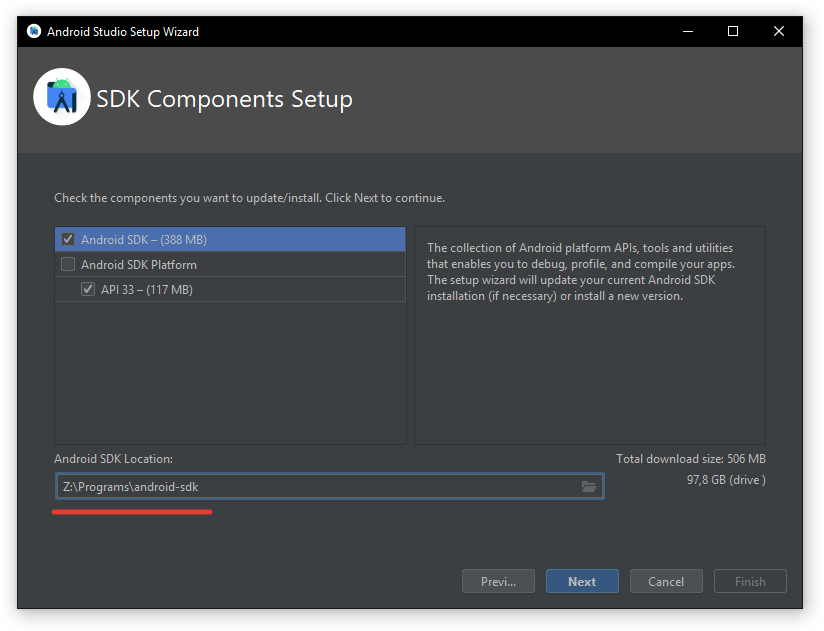

## Настройка SDK

Если все прошло успешно должно появится следующее окно.

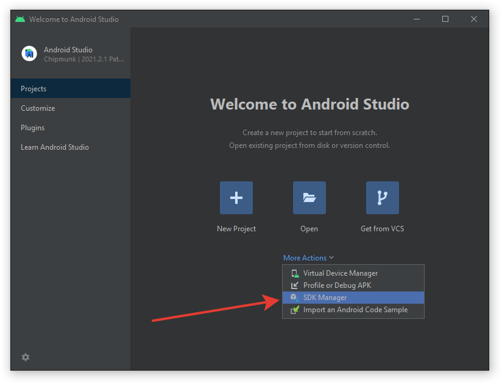

Идем в раздел `More Actions`, выбираем `SDK Manager`.


В разделе `SDK Tools` добавляем `Android SDK Command Line Tools (lates)`.

Затем, справа внизу, ставим галочку `Show Package Details` и в списке `Android SDK Build Tools` выбираем версию `30.0.3`. Именно это версия утилит требуется `Cordova` на момент написания этого текста.

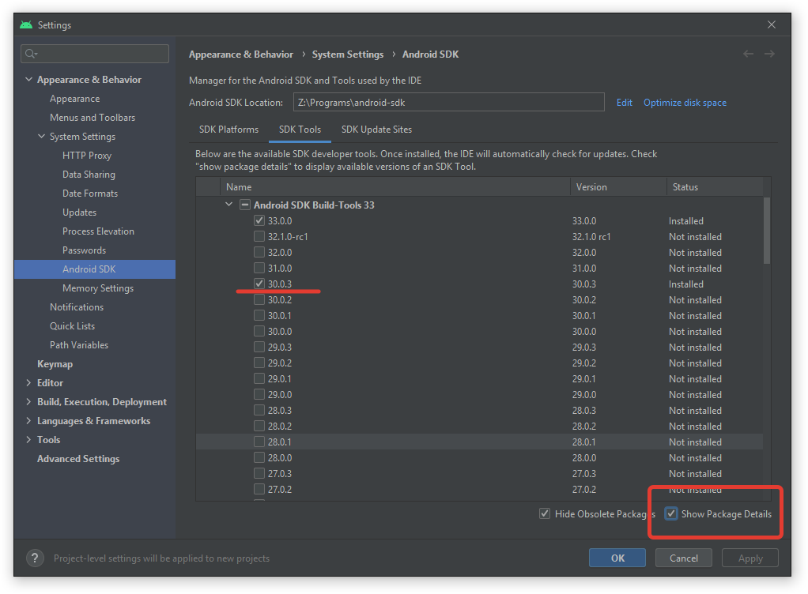

Также, обращаем внимание на путь `Android SDK Location`, он потребуется нам позже.

Не забываем нажать `Apply`

## JDK 11 (OpenJDK 11)

Россия под санкциями, при создании аккаунта невозможно указать Россию. Хартьфу на них, опухнут с голоду без нашего гаZа тVари. 

Качаем OpenJDK.

[https://jdk.java.net/archive/](https://jdk.java.net/archive/)

Более точная ссылка: [openjdk-11.0.2_windows-x64_bin.zip](https://download.java.net/java/GA/jdk11/9/GPL/openjdk-11.0.2_windows-x64_bin.zip)

Куда то распаковываем, запоминаем куда. 

## Gradle

Какой то сборщик... в общем нужен.

[https://gradle.org/install/](https://gradle.org/install/)

Вроде тут можно выбрать версию: [https://gradle.org/releases/](https://gradle.org/releases/)

На момент написания статьи это `7.4.2`.

Версию я выбрал `complite` которая на 50 мегабайт больше чем `binary` которая весит порядка 100 мегабайт. (Ох уж это будущее)

Распаковываем, не бываем куда.

## Настройка переменных среды

Жмем кнопку Windows на клавиатуре и начинаем набирать `среды`. Поиск находит `Изменение системных переменных среды`, его и нажимаем.

Либо идем в `Параметры` -> `Система` -> `О системе` -> справа находим `Сведенья о системе` -> слева `Дополнительные параметры системы`

Возможно, есть другой путь, но я его не знаю.

В появившемся окну во вкладке дополнительно жмем `Параметры среды`.

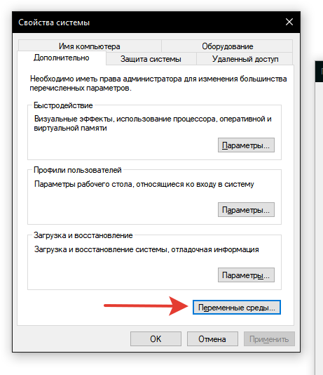

Все переменные создаем в разделе `Системные переменные`

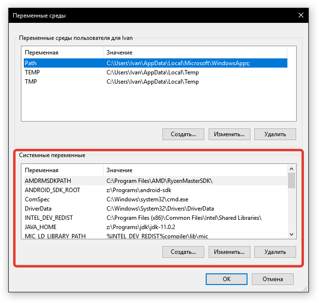

### ANDROID_SDK_ROOT

ANDROID_SDK_ROOT - указывает на место, где расположен `Android SDK`. Узнать точное расположение можно в `Android Studio` в разделе `SDK Manager` о котором говорилось выше.

Создаем переменную и указываем соответствующее значение. 

У меня это `z:\Programs\android-sdk`

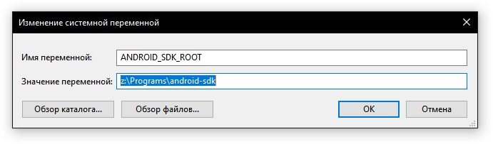

### JAVA_HOME

JAVA_HOME - указывает расположение JDK 

У меня это `z:\Programs\jdk\jdk-11.0.2`

### PATH

Переменная `Path` у вас скорее всего уже есть и создавать ее не нужно. Просто заходим внутрь и добавляем следующие значения:

* `z:\Programs\android-sdk\cmdline-tools` 
* `z:\Programs\android-sdk\platform-tools`
* `z:\Programs\android-sdk\emulator`
* `z:\Programs\android-sdk\build-tools\33.0.0`
* `z:\Programs\gradle\bin`
* `z:\Programs\jdk\jdk-11.0.2\bin`

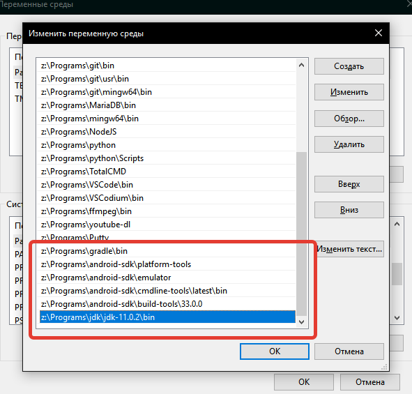

Как видите, часть путей это утилиты из `Android SDK`, а также `Gradle` и `JDK`.

# Виртуально устройство.

Для просмотра результата нам понадобится создать эмулятор устройства на котором будет запускаться наше приложение при отладке. В `Android Studio` на странице приветствия, там же, где и `SDK Manager` заходим в `Virtual Device Manager`.

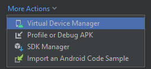

Создаем новое устройство `Create device`

Выбираем понравившееся из списке, либо создаем свое. Разница там только в разрешении экрана и объеме памяти, так что особо не заморачиваемся.

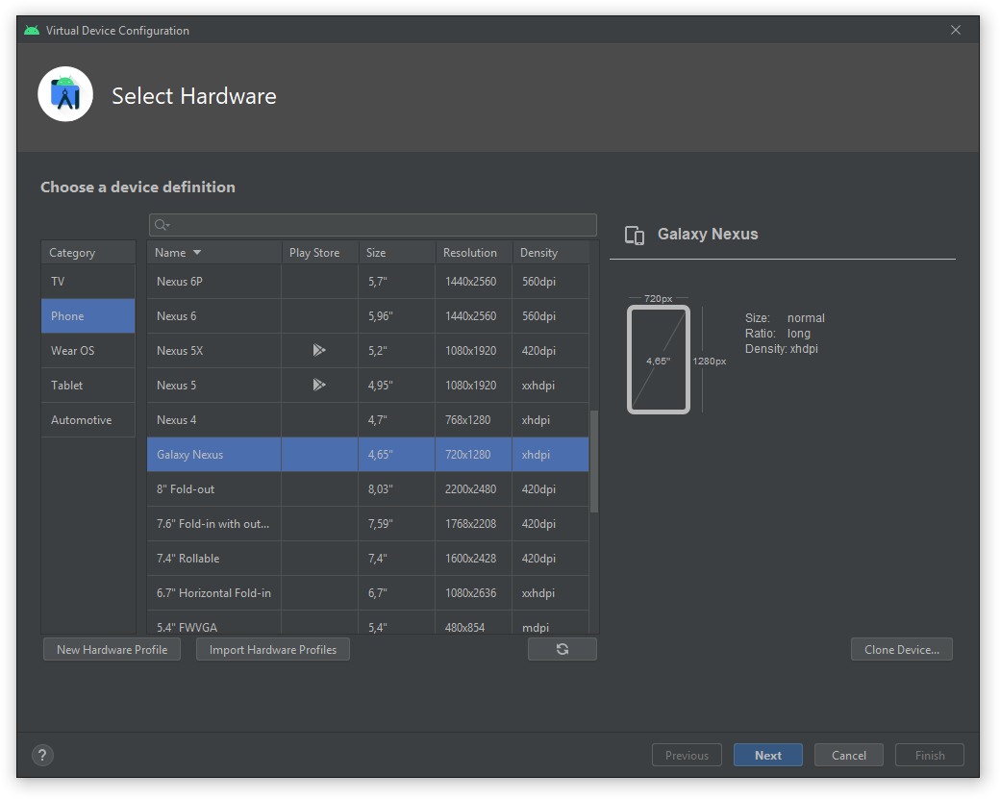

Выбираем интересующую нас версию OS и нажимаем кнопку `Download`.

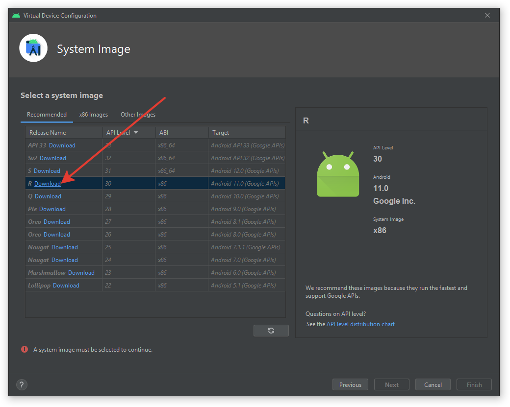

Под конец называем наш первый телефон `default`. Именно телефон с таким названием `Cordova` использует по умолчанию.

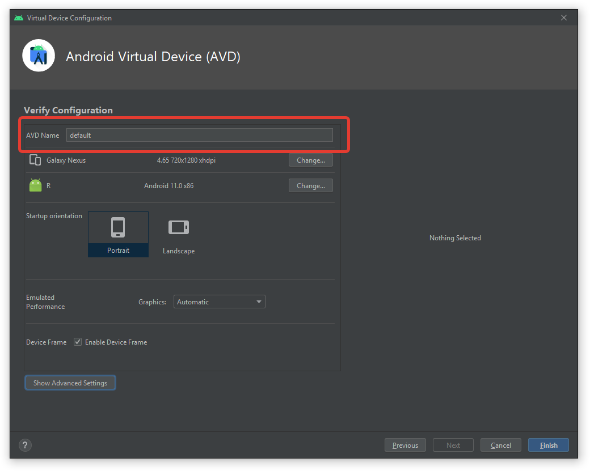

Теперь можно поиграться, в списке устройств появится телефон с названием `default`, справа будет стрелочка для запуска, нажимаем, ждем, и о боже, у вас на экране работающий телефон на `Android`. Можно даже в игры поиграть. Хотя, в 11 android под телефон что я выбрал не было `Play Market`, но в других я точно видел, например в `Android 7.0 (Nougat)`.

## MyApp

Очень надеюсь что у вас установленна `NodeJS`, так как без нее ничего не получится а процесс ее установки выходит за рамки статьи.

Если нет, качаем тут: [https://nodejs.org/en/](https://nodejs.org/en/)

Если у вас была запущена консоль, закройте ее и запустите вновь, что бы обновились переменные среды.

Зайдите в папку где вы хотите создать проект. 

Первым делом устанавливаем `cordova`. Установку делаем глобально, по этому повторят этот щаг в будущем не придется.

```
npm install -g cordova
```

Теперь, при помощи установленной нами `Cordova` создаем проект и добавляем к нему платформу `android`.

```
cordova create MyApp
cd MyApp
cordova platform add android
```

Запускаем.

```
cordova run android
```

В результате у вас должен запуститься эмулятор с именем "default" в котором запустится ваше приложение. По умолчанию это картинка с коробкой роботом.

Если не получилось: `goto 0`

Если у вас несколько эмуляторов, то можно сделать следующее.

Получаем список доступных утсройств:

```
cordova run android --list
```

Указываем устройство при запуске:

```
cordova run android --target="default"
```

В папке проекта есть папка `WWW`. В нее помещаем ваше веб приложение, это обычная страница `html`, запускаем `cordova run android` и вуаля, вы автор настоящего приложения Android.

Также, любопытства ради, можно попробовать `cordova build` и получить в папке `platforms/android/app/build/outputs/apk/debug/app-debug.apk` который можно скопировать на телефон и установить как приложение, и оно будет работать.

## Иконка приложения

Для иконки нужно несколько `png` разного размера (размеры гляди в примере).

В проекте создаем папку `/resource/android/icon` и кладем туда картинки с иконками. 

Далее в `config.xml` (в корне проекта) добавляем.

```xml
<platform name="android">
    <icon src="resource/android/icon/ldpi.png" width="36" height="36" density="ldpi" />
    <icon src="resource/android/icon/mdpi.png" width="48" height="48" density="mdpi" />
    <icon src="resource/android/icon/hdpi.png" width="72" height="72" density="hdpi" />
    <icon src="resource/android/icon/xhdpi.png" width="96" height="96" density="xhdpi" />
    <icon src="resource/android/icon/xxhdpi.png" width="144" height="144" density="xxhdpi" />
    <icon src="resource/android/icon/xxxhdpi.png" width="192" height="192" density="xxxhdpi" />
</platform>
```

## Подписываем приложение (финальная сборка)

Делаем все в корне проекта.

Генерируем ключ:

```
keytool -genkey -v -keystore appname.keystore -alias appname -keyalg RSA -keysize 2048 -validity 10000
```

После запуска `keytool` спросит набор информации для подписи, после чего будет создан файл `appname.keystore`.

Создаем `build.json`. 

По умолчанию для `release` используется `"packageType": "bundle"` и выходной файл имеет формат `aab`. Я пока точно не уверен, но возможно для публикации на маркете надо именно `.aab` а не `.apk`.

```json
{
    "android": {
        "debug": {
            "keystore": "./appname.keystore",
            "storePassword": "1234",
            "alias": "appname",
            "password" : "1234",
            "keystoreType": "jks",
            "packageType": "apk"
        },
        "release": {
            "keystore": "./appname.keystore",
            "storePassword": "1234",
            "alias": "appname",
            "password" : "1234",
            "keystoreType": "jks",
            "packageType": "apk"
        }
    }
}
```

Теперь можно выполнить финальную сборку. 

```
cordova build android --release
```

Готовый apk находим где то тут `platforms\android\app\build\outputs\apk\release\app-release.aab `

Есть мнение, что файл готов к публикации на маркете, но это не точно.
