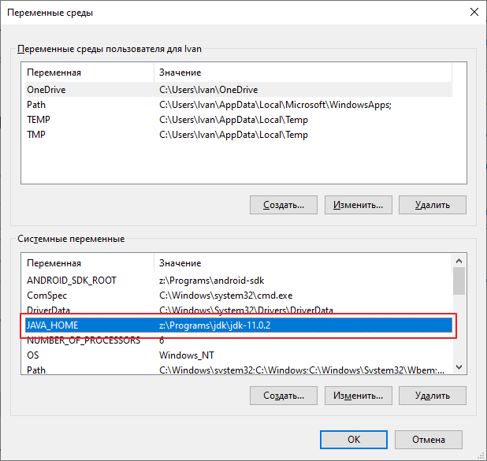
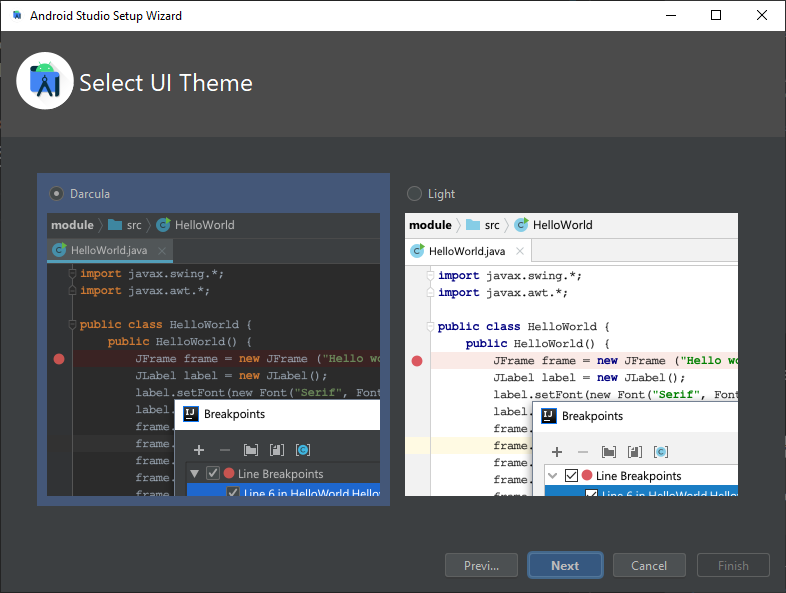
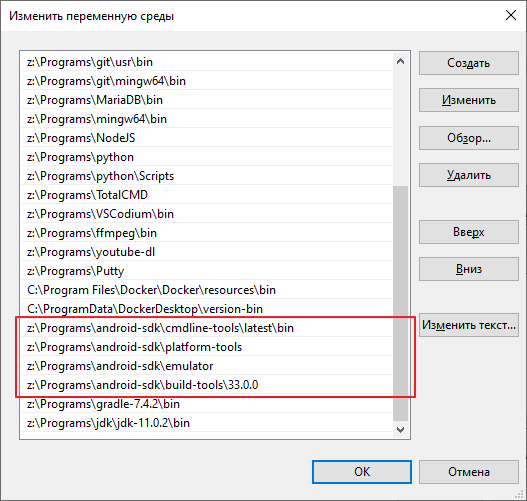

# Установка и настройка Apache Cordova на Windows для создания приложения на Android

- [Установка Open JDK (Java Development Kit)](#установка-open-jdk-java-development-kit)
- [Установка Gradle](#установка-gradle)
- [Установка Android Studio](#установка-android-studio)
- [Установка Apache Cordova](#установка-apache-cordova)
- [Создание проекта](#создание-проекта)
- [Запуск проекта](#запуск-проекта)
- [Сборка проекта](#сборка-проекта)
- [Иконка приложения](#иконка-приложения)

`Apache Cordova` позволяет программистам создавать приложения для мобильных устройств с помощью `CSS3`, `HTML5` и `JavaScript`, вместо того, чтобы использовать конкретные платформы API, такие как `Android`, `IOS` или `Windows Phone`.

# Установка Open JDK (Java Development Kit)

`Open JDK` - комплект разработчика приложений на `Java`.

Скачать и распаковать в папку с программами: [openjdk-11.0.2_windows-x64_bin.zip](https://download.java.net/java/GA/jdk11/9/GPL/openjdk-11.0.2_windows-x64_bin.zip)

Страница скачивания OpenJDK: [https://jdk.java.net/archive/](https://jdk.java.net/archive/)

Добавляем переменную окружения `JAVA_HOME`:

```
JAVA_HOME = z:\Programs\jdk\jdk-11.0.2
```



Добавляем путь в `PATH`

```
z:\Programs\jdk\jdk-11.0.2\bin
```


# Установка Gradle

`Gradle` - пакетный менеджер для Java.

Скачать и распаковать в папку с программами: [https://gradle.org/releases/](https://gradle.org/releases/)

Добавляем путь в `PATH`

```
z:\Programs\gradle-7.4.2\bin
```


# Установка Android Studio

`Android Studio` - среда разработки приложений для `Android`.

Скачать и распаковать в папку с программами или установить: [https://developer.android.com/studio#downloads](https://developer.android.com/studio#downloads)

Я использую `zip` версию (No .exe installer), по этому порядок действий может отличаться от инсталлятора.

Запускаем `studio64.exe`.

Импортирование настроек - импортировать нечего, устанавливаем в `Do not import`.


Помощь в улучшении `Android Studio` - выбираем по вкусу.


Тип инсталляции - выборочная (`custom`).


Указываем папку с JDK которое будет использовать Gradle для сборки проектов.


Выбираем тему редактора.



Указываем папку где будут храниться файлы `Android SDK`.


Соглашаемся с лицензией и скачиваем компоненты Android SDK.


Ждем окончания загрузки и установки компонент.


На этом моменте мастер настроек заканчивается и Вас направляют в окно приветствия `Android Studio`.

Настройки сохраняются в папку:

```
%APPDATA%/Google/AndroidStudio2021.2
```

Для меня это:

```
c:\Users\Ivan\AppData\Roaming\Google\AndroidStudio2021.2
```

> Если удалить папку настроек, то мастер настроек запуститься вновь при запуске `studio64.exe`.

Идем в настройки `Android SDK` - `Projects` / `More Actions` / `SDK Manager`


В разделе `Appearance & Behavior` \ `System Settings` \ `Android SDK` \ `SKD Tools` указываем следующие компоненты:

- Android SDK Command-line Tools (latest)


Жмем `Apply` и загружаем указанные пакеты.


Ставим галочку на `Show Package Details` и подключаем `Android SDK Build Tools` версии `30.0.3`. Установленную по умолчанию версию можно отключить.


Жмем `Apply`, качаем пакеты.

Жмем `OK` и возвращаемся в окно приветствия.

Добавляем системную переменную `ANDROID_SDK_ROOT` указывающую на папку в которой хранится SDK.

```
ANDROID_SDK_ROOT = `z:\Programs\android-sdk`
```


Узнать, путь к Android SDK на вашей машине можно в настройках SDK - `Android SDK` - `Projects` / `More Actions` / `SDK Manager`


Добавляем в `PATH` следующие пути:

- z:\Programs\android-sdk\cmdline-tools\latest\bin
- z:\Programs\android-sdk\platform-tools
- z:\Programs\android-sdk\emulator
- z:\Programs\android-sdk\build-tools\33.0.0



Возвращаемся в `Android Studio` и заходим в `Projects` / `More Actions` / `Virtual Device Manager`


Жмем `Create Device`.


Выбираем модель устройства которое будет эмулироваться.


Выбираем интересующую нас операционную систему. Если активен пункт `download` жмем его, для того что бы скачать образ системы.


Указываем имя устроиства `default`. Это важно, так как `Cordova` по умолчанию будет использовать устройство с именем `default` при отладке вашего проекта. Иначе, придется указывать имя устройства в ручную, что усложнит команду запуска.


Запускаем созданное устройство для того, что бы убедится в том, что оно работает.


# Установка Apache Cordova

Для установки `Apache Cordova` нежен пакетный менеджер `npm` который входит в состав `NodeJS`.

Скачать и установить NodeJS: [https://nodejs.org/en/download/](https://nodejs.org/en/download/)

Устанавливаем `Apache Cordova`.

```
npm install cordova -g
```

# Создание проекта

```
cordova create MyApp
cd MyApp
cordova platform add android
```

В папку `www` помещаем файлы вашего веб приложения (страницы).

# Запуск проекта

```
cordova run android
```


По умолчанию cordova запускает приложение на эмуляторе с именем `default`. Для того, что бы указать какой эмулятор использовать указываем параметр `--target="name"`.

```
cordova run android --target="Nexus_One_API_25"
```


Получить список устройств можно следующим образом:

```
cordova run android --list
```


# Подпись проекта

Генерируем ключ:

```
keytool -genkey -v -keystore myapp.keystore -alias myapp -keyalg RSA -keysize 2048 -validity 10000
```

Создаем файл `build.json`.

```json
{
    "android": {
        "debug": {
            "keystore": "./myapp.keystore",
            "storePassword": "123123",
            "alias": "myapp",
            "password" : "123123",
            "keystoreType": "jks",
            "packageType": "apk"
        },
        "release": {
            "keystore": "./myapp.keystore",
            "storePassword": "123123",
            "alias": "myapp",
            "password" : "123123",
            "keystoreType": "jks",
            "packageType": "apk"
        }
    }
}
```

По умолчанию для `release` используется `"packageType": "bundle"` и выходной файл имеет формат `.aab`. По непроверенной мной информации файл формата `.aab` нужен для публикации на маркете.

# Сборка проекта

```
cordova build android --release
```


# Иконка приложения

Для иконки нужно несколько `png` разного размера.

В проекте создаем папку `/resource/android/icon` и помещаем туда картинки с иконками.

В `config.xml` добавляем.

```xml
<platform name="android">
    <icon src="resource/android/icon/ldpi.png" width="36" height="36" density="ldpi" />
    <icon src="resource/android/icon/mdpi.png" width="48" height="48" density="mdpi" />
    <icon src="resource/android/icon/hdpi.png" width="72" height="72" density="hdpi" />
    <icon src="resource/android/icon/xhdpi.png" width="96" height="96" density="xhdpi" />
    <icon src="resource/android/icon/xxhdpi.png" width="144" height="144" density="xxhdpi" />
    <icon src="resource/android/icon/xxxhdpi.png" width="192" height="192" density="xxxhdpi" />
</platform>
```