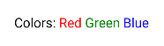

# Компоненты React Native

4. [Компоненты React Native](#компоненты-react-native)
    - [View, Text, StyleSheet](#view-text-stylesheet)
    - [Вложенный текст (Nested)](#вложенный-текст-nested)
    - [Image, ImageBackground](#image-imagebackground)
    - [TextInput](#textinput)
    - [ScrollView](#scrollview)
    - [StatusBar](#statusbar)
    - [BackHandler](#backhandler)
    
## View, Text, StyleSheet

Пример который выведет жирным "Hello World!" по середине экрана красным цветом.

```jsx
import { View, Text, StyleSheet } from 'react-native'

export default function App() {
  return <View style={styles.container}>
    <Text style={[styles.red, styles.bold]}>Hello world!</Text>
  </View>
}

const styles = StyleSheet.create({
  container: {
    flex: 1,
    alignItems: 'center',
    justifyContent: 'center'
  },
  red: {
    color: 'red'
  },
  bold: {
    fontWeight: 'bold'
  }
})
```

`<View>` - контейнер для других элементов.

Как я понял в `React Native` принято активно использовать `flex` разметку. Похоже, изначально рабочая область (аналог body) уже имеет атрибут `flex` - аналог `display: flex` которого нет в `React Native`. По этому в стиле для `<View style={styles.container}>` указываем `flex: 1`, что значит что элемент займет всю область. Если указать для одного элемента 1 а для другого 2 то первый займет 1/3 (33%) а второй 2/3(67%)) соответственно.

Подробнее о флексах в `React Native`: [https://reactnative.dev/docs/flexbox#flex](https://reactnative.dev/docs/flexbox#flex)

`<Text>` - текст.

`StyleSheet` - объект хранящий стили.

Стили могут быть составные. Задаём их в виде массива где указываем несколько стилей.

```jsx
<Text style={[styles.red, styles.bold]}>Hello world!</Text>
```

Стили можно указывать непрямую.

```jsx
<Text style={{color: 'red'}}>
```

## Вложенный текст (Nested)

Каждый новый тег `<Text>` выведет текст в виде новой строки. Но, если вложит теги `<Text>` в тег `<Text>`, то строки выведутся последовательно в виде одной строки.

```jsx
export default function App() {
  return <View style={styles.container}>
    <Text>Colors: </Text>
    <Text style={styles.red}>Red </Text>
    <Text style={styles.green}>Green </Text>
    <Text style={styles.blue}>Blue</Text>
  </View>
}
```


```jsx
  return <View style={styles.container}>
    <Text>
      Colors: <Text style={styles.red}>Red </Text>
      <Text style={styles.green}>Green </Text>
      <Text style={styles.blue}>Blue</Text>
    </Text>
  </View>
```



Используем вложенный текст для форматирования текста внутри строки.

## Image, ImageBackground

`Image` - картинка.

`ImageBackground` - картинка в которую может быть вложено содержимое. Во всем остальном `Image` и `ImageBackground` схожи.

Картинки должны находится внутри `View`. Использовать `ImageBackground` вместо `View` не получится, ругается. 

Не получится задать `backgroundImage` внутри стиля. 

Картинку импортируем через `import` и передаем через параметр `source` (не `src`). ~~Задать картинку внутри тега мне не удалось, только через `import`.~~ Задать картинку внутри тега `source={require('./assets/background.jpg')}`.

```jsx
import { 
  View, 
  Text, 
  StyleSheet,
  ImageBackground
} from 'react-native'

import backgroundImage from './assets/background.jpg'

export default function App() {
  return <View style={styles.container}>
    <ImageBackground style={styles.background} source={backgroundImage} resizeMode='cover'>
      <Text>ImageBackground example</Text>
    </ImageBackground>
  </View>
}

const styles = StyleSheet.create({
  container: {
    flex: 1
  },
  background: {
    flex: 1,
    justifyContent: 'center',
    alignItems: 'center'
  },
})
```


## TextInput

[https://reactnative.dev/docs/textinput](https://reactnative.dev/docs/textinput)

`TextInput` - поле для ввода текста.

```jsx
import { useState } from 'react'
import { 
  View, 
  TextInput, 
  StyleSheet,
} from 'react-native'

export default function App() {

  const [text, onChangeText] = useState('')

  return <View style={styles.container}>
    <TextInput 
      style={styles.text_input} 
      onChangeText={onChangeText}
      value={text}
      placeholder='Placeholder'
    />
  </View>

}

const styles = StyleSheet.create({
  container: {
    flex: 1,
    justifyContent: 'center',
  },
  text_input: {
    borderWidth: 1,
    margin: 10,
    padding: 10,
  }
})
```

В случае если поле ввода использует несколько строк стиль рамки не будет работать и рекомендуется вставлять такое поле в отдельный `<View>` для которого задать рамку.

## ScrollView

`ScrollView` - это View не ограниченный по высоте с возможностью пролистывать (скролить) содержимое.

## StatusBar

`StatusBar` - строка статуса. 

Утверждается (я не проверял) что их может быть несколько, но как показал практика, нужна хотя бы одна в коде для того, что бы избавиться от иконок статусной строки сверху экрана по верх приложения.

Без `<StatusBar />` элементы строки статуса перекрывают приложение.


С `<StatusBar />` все встало на свои места.


## BackHandler

Doc: [https://reactnative.dev/docs/backhandler](https://reactnative.dev/docs/backhandler)

`BackHandler` - обработчик нажатия кнопки назад в `Android`. Если верить документации, в `iOS` его нет.

Где то внутри корневого компонента (App)

```js
import {useEffect} from 'react'
import {BackHandler} from 'react-native'
```

```js
function App() {
  
  ...

  // Обработка нажатия кнопки назад.

  function back() {
      if (screenStack.length) {
          setScreen(screenStack.pop())
      } else {
          BackHandler.exitApp()
      }
      // Если вернуть false не будет работать.
      return true
  }

  // Установка обработчика клавиши назад.

  useEffect(() => {
      const backHandler = BackHandler.addEventListener('hardwareBackPress', back)
      return () => backHandler.remove()
  }, [])  
```

Методы `BackHandler`:

- `BackHandler.addEventListener(eventName, handler)` - установка обработчика события.
- `BackHandler.removeEventListener(eventName, handler)` - удаление обработчика события.
- `BackHandler.exitApp()` - выход из приложения. Делает то, что должна делать кнопка назад.


