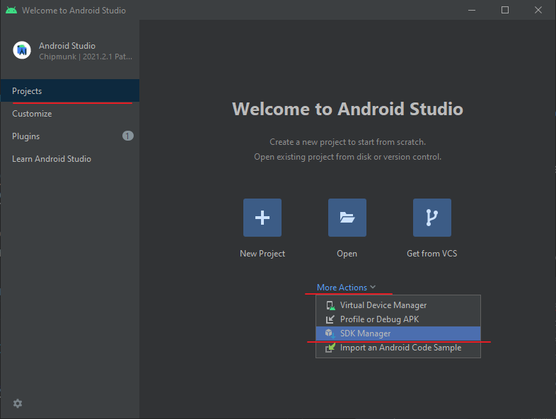
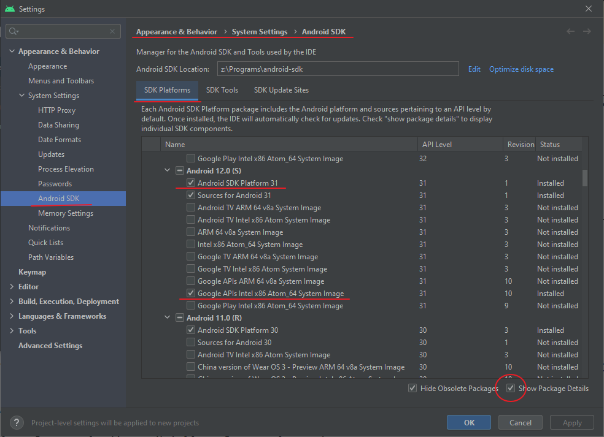
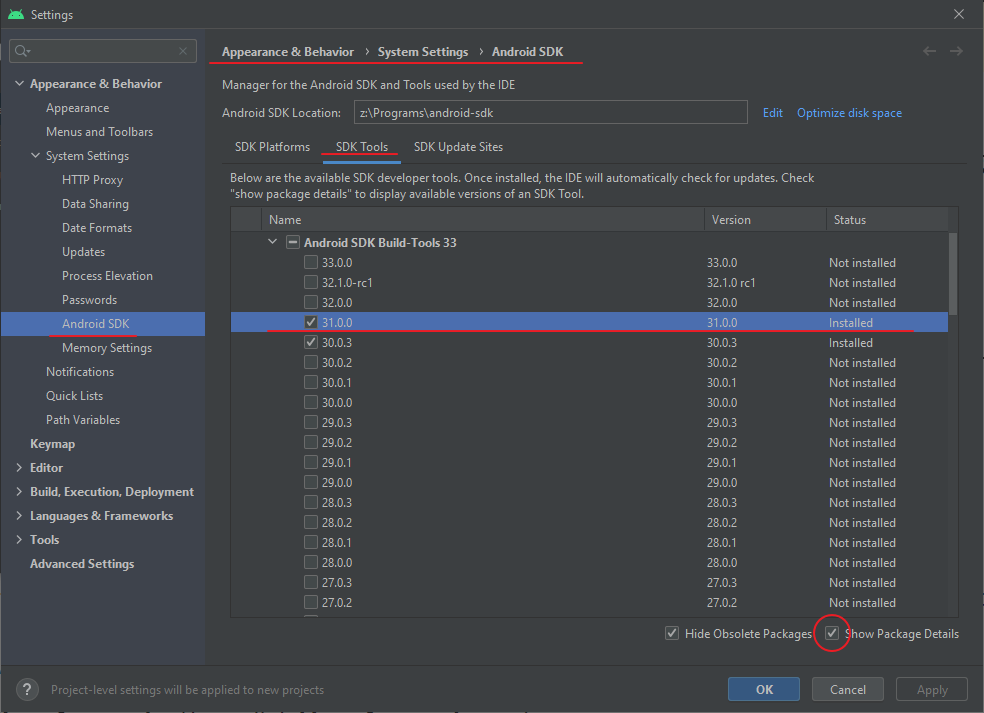
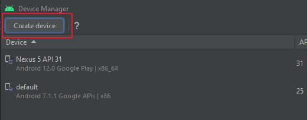
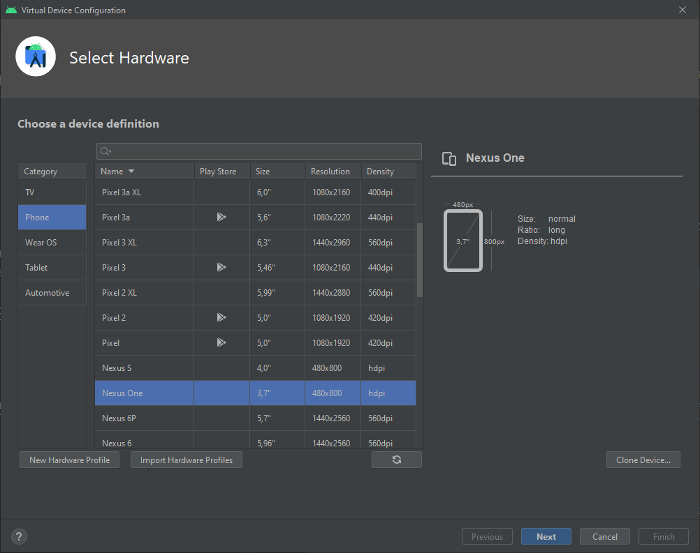
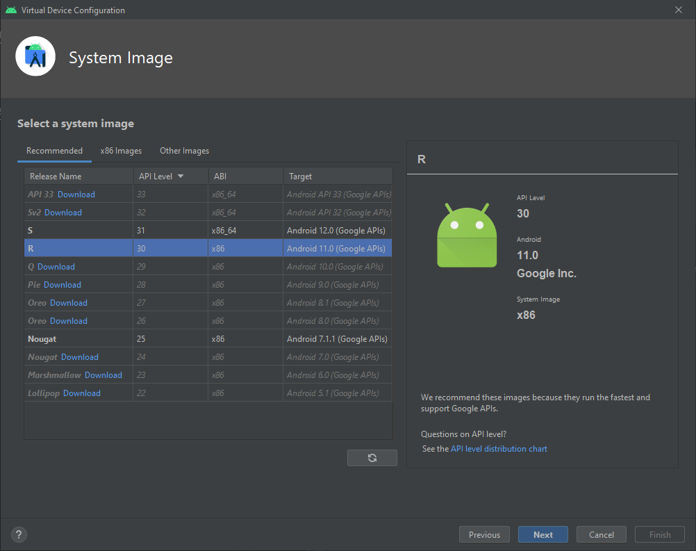
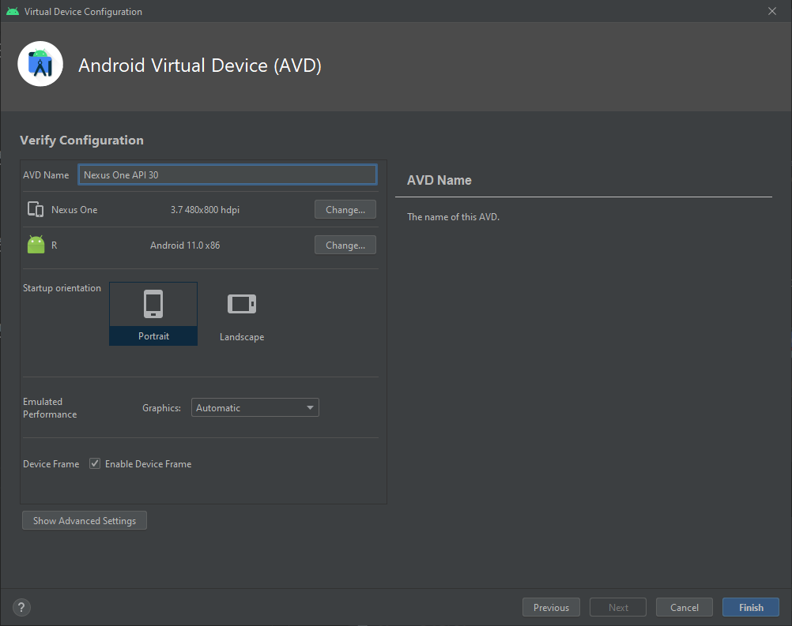

# React Native - установка и создание проекта.

- [Установка](#установка)
- [Создание проекта](#создание-проекта)
- [Запуск проекта](#запуск-проекта)
- [Запуск приложения на указанном эмуляторе](#запуск-приложения-на-указанном-эмуляторе)
- [Финальная сборка](#финальная-сборка)
- [Уменьшаем размер `.apk`](#уменьшаем-размер-apk)
- [Иконка приложения](#иконка-приложения)

# Установка

Оригинальная документация по установке и настройки окружения: [https://reactnative.dev/docs/environment-setup](https://reactnative.dev/docs/environment-setup)

Ранее, у меня были установленны компоненты для сборки Android приложения (JDK 11, Android Studio), так что, я не могу на 100% утверждать, что будет работать. С другой стороны, все что было в официальной документации я указал.

## Node JS

Скачать: [https://nodejs.org](https://nodejs.org)

## OpenJDK 11

Скачать: [https://download.java.net/java/GA/jdk11/9/GPL/openjdk-11.0.2_windows-x64_bin.zip](https://download.java.net/java/GA/jdk11/9/GPL/openjdk-11.0.2_windows-x64_bin.zip)

Добавляем переменную окружения JAVA_HOME:

```
JAVA_HOME = z:\Programs\jdk\jdk-11.0.2
```

Добавляем в PATH:

```
z:\Programs\jdk\jdk-11.0.2\bin
```

> Пути приведены как пример. На вашей системе путь к JDK будет другим.

## Android Studio

Скачать: [https://developer.android.com/studio#downloads](https://developer.android.com/studio#downloads)

Заходим в `More Actions` \ `SDK Manager`.



В `SDK Manager - Appearance & Behavior \ System Settings \ Android SDK` вкладка `SDK Platforms` устанавливаем галку на `Show Package Details`.

Далее, для `Android 12.0 (S)` устанавливаем:

- Android SDK Platform 31
- Google APIs Intel x86 Atom System Image



На вкладке `SDK Tools` устанавливаем `Android SDK Build-Tools 33` версию `31.0.0`.



Добавляем переменную окружения ANDROID_HOME

```
ANDROID_HOME = z:\Programs\android-sdk
```

> Путь к SDK приведен как пример и будет отличаться для вашей системы. Обычно это `%LOCALAPPDATA%\Android\Sdk`. 
>
> Узнать точный путь к SDK можно в Android Studio: `SDK Manager - Appearance & Behavior \ System Settings \ Android SDK`.

Добавляем путь к инструментам в PATH:

```
z:\Programs\android-sdk\platform-tools
```

Создаем новое устройство. Для этого возвращаемся на `Welcome Screen` и заходим в `More Actions` \ `Virtual Device Manager`.


Жмем `Create device`.



Выбираем устройство.



Выбираем систему.



Если система не установлена, жмем кнопку `download` в строке названия системы.

Завершаем создание устройства.



# Создание проекта

```
npx react-native init ProjectName
```

Результат, проект размером `374Мб` =E

# Запуск проекта

Запускаем проект.

```
npx react-native run-android
```

Собирает долго. 

Работает вроде шустро.

При запуске открылось на устройстве с именем `default`... хотя, другого у меня не было =\ так что это ничего не значит.

Приложение по умолчанию предлагает:

- отредактировать `app.js` - корневой файл приложения.

- `ctrl + m` - меню отладки приложения. Также можно нажать кнопку `Cmd` на устройстве или потрясти. Хы, кнопки может не быть, а как трясти эмулятор ??? =)

- `R` + `R` - нажатие `R` два раза перезапустит приложение. Также, перезапустить приложение можно из меню отладки.

Честно скажу, почерпнул из кода `app.js` пару интересных техник. Ни когда не указывал `props` через деструктуризацию (как `{value1, value1}`), а ведь это чертовски верный подход. Нужно запомнить.

В коде есть явное указание типа `Node`, но тут я видимо что то в React пропустил. Хотя `VSCodium` смотрит на подобное с подозрением.

> Позже я наткнулся на список фич `Javascript` которые могут использоваться в приложениях `React Native`. Там, можно почерпнуть для себя много интересного про Javascript, освежить и переосмыслить.
>
> Читаем тут: [https://reactnative.dev/docs/javascript-environment](https://reactnative.dev/docs/javascript-environment). 

# Запуск приложения на указанном эмуляторе

__Важно__: эмулятор должен быть запущен.

Запускаем эмулятор из Android Studio (More Action / Virtual Device Manager), либо из командной строки.

Получаем список эмуляторов:

```
emulator -list-avds
```

```
$ emulator -list-avds
Nexus_5_API_31
default
```

Запускаем эмулятор:

```
emulator -avd Nexus_5_API_31
```

Получаем список подключенных устройств, что бы получить ID:

```
adb devices
```

```
$ adb devices
List of devices attached
emulator-5554   device
```

Запускаем проект:

```
npx react-native run-android --deviceId="emulator-5554"
```

Этим способом можно запустить проект на физическом устройстве (телефоне или планшете) Для этого, на телефоне должны быть включена отладка по USB.

> Отладка по USB включается в настройках разработчика. Настройки разработчика скрыты, для активации идем в `Настройках телефона` идем  в `Система` \ `О телефоне` и жмем по пункту `Номер сборки` несколько раз, пока не увидите сообщение о том, что вы стали разработчиком. Теперь идем в меню разработчика, оно где то в настройках, и включаем отладку по USB. Подключаем телефон кабелем к компьютеру, соглашаемся на отладку.

```
$ adb devices
List of devices attached
OUKIC11000000788        device
```
`ID` получен. Делаем все как было указано выше и видим на телефоне наше приложение. Теперь можно потрясти телефон для того, что бы попасть в меню отладки =) Работает =)

# Финальная сборка

Android требует, чтобы все приложения были подписаны цифровой подписью. Эта подпись будет использоваться Google Play во всех последующих обновлениях вашего приложения. С 2017 года Google Play может автоматически управлять выпусками сертификатов благодаря функции App Signing by Google Play. Однако перед тем, как двоичный файл вашего приложения будет загружен в Google Play, его необходимо подписать с помощью ключа загрузки.

## Создаем ключ загрузки

```
keytool -genkeypair -v -storetype PKCS12 -keystore my-upload-key.keystore -alias my-key-alias -keyalg RSA -keysize 2048 -validity 10000
```

Создаст файл `my-upload-key.keystore`.

Ключ действителен 10000 дней (`-validity 10000`).

Помещаем ключ в папку `android/app`.

Добавляем в файл `android/gradle.properties` следующие строки:

```
MYAPP_UPLOAD_STORE_FILE=my-upload-key.keystore
MYAPP_UPLOAD_KEY_ALIAS=my-key-alias
MYAPP_UPLOAD_STORE_PASSWORD=*****
MYAPP_UPLOAD_KEY_PASSWORD=*****
```

Пароль тот же, что был указан при создании ключа загрузки.

> В документации предлагают использовать файл `~/.gradle/gradle.properties` вместо файла `android/gradle.properties` внутри проекта, благодаря чему можно исключить попадание данных ключа в сборку при размещении проекта на `Github` или других площадках. 
>
> В `Windows` используем путь `%USERPROFILE%\.gradle`, в моем случае это (`C:\Users\Ivan\.gradle`).
>
> Файла `gradle.properties` изначально нет, создал новый, будем посмотреть что получится.

Правим файл сборки `android/app/build.gradle`:

```
...
android {
    ...
    defaultConfig { ... }
    signingConfigs {
        release {
            if (project.hasProperty('MYAPP_UPLOAD_STORE_FILE')) {
                storeFile file(MYAPP_UPLOAD_STORE_FILE)
                storePassword MYAPP_UPLOAD_STORE_PASSWORD
                keyAlias MYAPP_UPLOAD_KEY_ALIAS
                keyPassword MYAPP_UPLOAD_KEY_PASSWORD
            }
        }
    }
    buildTypes {
        release {
            ...
            signingConfig signingConfigs.release
        }
    }
}
...
```

В `signingConfigs` добавляем поле `release`.

```
        release {
            if (project.hasProperty('MYAPP_UPLOAD_STORE_FILE')) {
                storeFile file(MYAPP_UPLOAD_STORE_FILE)
                storePassword MYAPP_UPLOAD_STORE_PASSWORD
                keyAlias MYAPP_UPLOAD_KEY_ALIAS
                keyPassword MYAPP_UPLOAD_KEY_PASSWORD
            }
        }
```

В `buildTypes.release` правим `signingConfig signingConfigs.debug` на `signingConfig signingConfigs.release`

Заходим в папку `android` консолью и выполняем:

```
gradlew bundleRelease
```

Получаем `app-release.aab` файл по пути `android/app/build/outputs/bundle/release/app-release.aab`.

Запускаем собранный проект:

```
npx react-native run-android --variant=release
```

> O_o Получаем 100500 ошибок =)
>
> Запускаю просто:
>
> ```
> npx react-native run-android
> ```
> 
> Работает, значит не сломал а что то > недоделал. Ну, хоть что то хорошее =)
>
> Немного гугла и оказалось, надо было __удалить старое приложение__ с телефона. Удалил, заработало =)

Финальный `.apk` можно найти тут:

```
android\app\build\outputs\apk\release\app-release.apk
```

> Однако O_o
>
> - `app-release.apk` - 27мб
> - `app-debug.apk` - 59мб
> - Cordova apk `factorculator.apk` - 1.7мб

# Уменьшаем размер `.apk`

Файл `android/app/build.gradle`

- `enableProguardInReleaseBuilds = true` - эта опция включит Proguard для компрессии байт кода Java. 
    
  Снизило размер `.apk` с `27мб` до `25мб`.

- `enableSeparateBuildPerCPUArchitecture = true` - эта опция включает режим когда при сборке создаются отдельные `.apk` для разных типов систем (arm, arm64, x86, x86-64), иначе, все версии будут помещены в один файл. По отдельности они весят по `6-8Мб`.

# Иконка приложения

`android\app\src\main\AndroidManifest.xml` - файл в котором описаны параметры приложения, в том числе иконка.

Картинки иконки для Android лежат тут: `android\app\src\main\res`.

Картинки разложены по папочкам, каждая для своего разрешения.

А вот тут, текст под иконкой `android\app\src\main\res\values\strings.xml`. Хотя, его можно явно задать в `android\app\src\main\AndroidManifest.xml`, но, наверное лучше так.